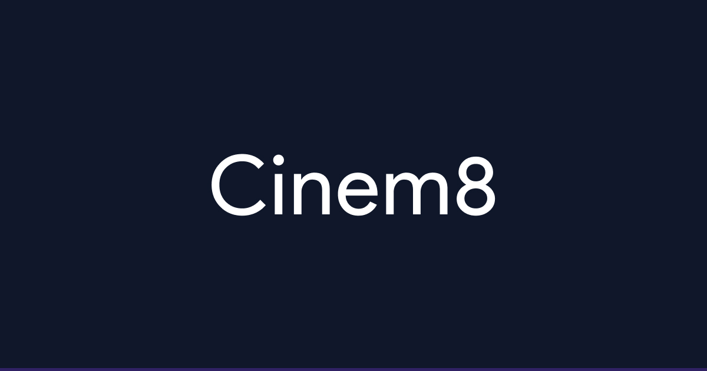

# Cinem8



> **Your Instant Cinema Mate.**
> A sleek, high-performance movie database built for speed and aesthetics.

[](https://reactjs.org/)
[](https://tailwindcss.com/)
[](https://vitejs.dev/)

## Live Demo

**[View Live Demo](https://krayetor-cinem8.vercel.app/)**

---

## About The Project

**Cinem8** is a modern web application designed to be the fastest way to find comprehensive details about movies. Built as a Capstone Project for the **ALX Frontend Web Development Program**, the application prioritizes speed, data persistence, and a highly polished user interface over unnecessary clutter.

It leverages the **TMDB API** to provide real-time access to millions of movies, cast details, and trailers.

### Key Features

* **Instant Search:** Real-time search functionality with a typewriter effect on the landing page.
* **Dark/Light Mode:** Fully responsive theme toggling with local storage persistence.
* **Favorites System:** Add movies to your personal collection. Data persists even after closing the browser.
* **Deep Persistence:** Search terms are synced with the URL, allowing you to share search results via links.
* **Fully Responsive:** Optimized layouts for Mobile, Tablet, and Desktop screens.
* **Smart UI:** Features skeleton loading states, fallback images, and dual-layered hover animations.

---

## Tech Stack

| Category | Technology | Purpose |
| :--- | :--- | :--- |
| **Framework** | React 18 (Vite) | Component-based UI architecture |
| **Styling** | Tailwind CSS | Utility-first styling & responsiveness |
| **Routing** | React Router DOM | Client-side routing & URL parameters |
| **State** | React Context API | Managing Global Favorites state |
| **Data** | Axios | Handling API requests |
| **API** | TMDB API | Source of movie data |

---

## Getting Started

Follow these steps to set up the project locally on your machine.

### Prerequisites

* Node.js (v14 or higher)
* npm or yarn

### Installation

1.  **Clone the repository**
    ```bash
    git clone [https://github.com/krayetor/cinem8.git](https://github.com/krayetor/cinem8.git)
    cd cinem8
    ```

2.  **Install dependencies**
    ```bash
    npm install
    ```

3.  **Setup Environment Variables**
    * Create a `.env` file in the root directory.
    * Get your API Key from [The Movie Database (TMDB)](https://www.themoviedb.org/).
    * Add the key to your file:
    ```env
    VITE_TMDB_API_KEY=your_api_key_here
    ```

4.  **Run the development server**
    ```bash
    npm run dev
    ```

5.  Open [http://localhost:5173](http://localhost:5173) in your browser.

---

## Project Structure

```text
src/
├── components/      # Reusable UI components (Header, MovieCard, Skeleton)
├── context/         # Global state (FavoritesContext)
├── hooks/           # Custom hooks (useTypewriter)
├── pages/           # Main views (Home, About, Favorites, MovieDetails)
└── main.jsx         # Entry point